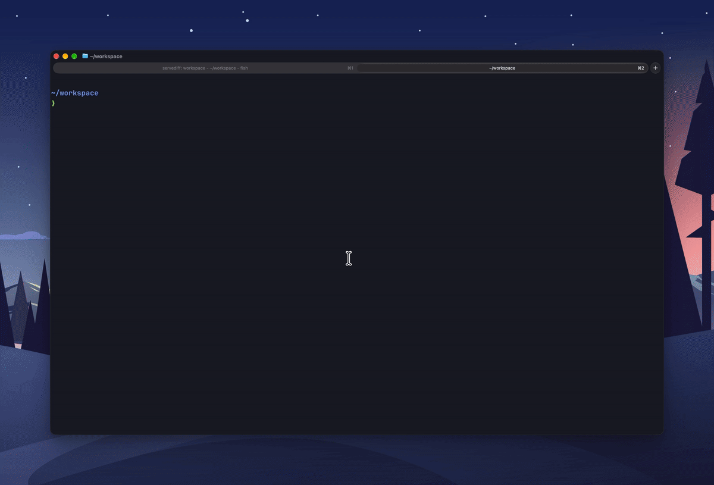

# gitsy

gitsy is a tiny CLI that scans a directory for git repositories and linked worktrees, automatically fetches from upstream, and updates local repos. It displays status in a nice TUI so you can see what needs attention.



## Install

```bash
brew install flexdinesh/tap/gitsy
```

```bash
go install github.com/flexdinesh/gitsy/cmd/gitsy@latest
```

## Usage

```bash
# Show all discovered repositories under the current directory.
gitsy

# Fast-forward repositories that can safely update without conflicts.
gitsy --sync

# Scan repository directories up to a specific nested depth.
gitsy --max-depth 5

# Start scanning from a specific directory instead of the current directory.
gitsy --dir ~/workspace

# Skip fetching upstream changes and use local status only.
gitsy --no-fetch

# Print warnings for skipped repos and failed git commands.
gitsy --verbose

# Show help.
gitsy --help

# Show the installed version.
gitsy --version
```

## Development

See [docs/development.md](docs/development.md).

## Releases

Releases are created from `main`. See [docs/release.md](docs/release.md).
