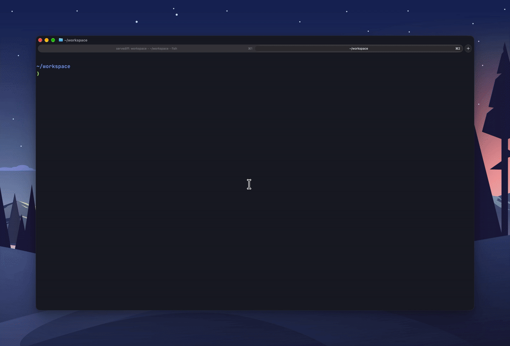

# gitsy

gitsy is a tiny CLI that scans a directory for git repositories and linked worktrees, automatically fetches from upstream, and updates local repos. It displays status in a nice TUI so you can see what needs attention.



## Install

```bash
brew install flexdinesh/tap/gitsy
```

```bash
go install github.com/flexdinesh/gitsy/cmd/gitsy@latest
```

## Usage

```bash
# Show all discovered repositories under the current directory.
gitsy

# Fast-forward repositories that can safely update without conflicts.
gitsy --sync

# Scan repository directories up to a specific nested depth.
gitsy --max-depth 5

# Start scanning from a specific directory instead of the current directory.
gitsy --dir ~/workspace

# Scan multiple directories and include their repositories' linked worktrees.
gitsy --dir ~/workspace/org-one --dir ~/workspace/org-two

# Skip fetching upstream changes and use local status only.
gitsy --no-fetch

# Print warnings for skipped repos and failed git commands.
gitsy --verbose

# Show help.
gitsy --help

# Show the installed version.
gitsy --version
```

Use `↑/↓` or `j/k` to select repositories, `Tab` to toggle file details,
`PgUp/PgDn` or the mouse wheel to scroll, and `q` to quit. Wide terminals
show context for the selected repository. Colors adapt to light and dark themes.

With `--dir`, only the supplied directories are scanned. `--max-depth` applies
to each directory; linked worktrees are included wherever they live. Relative
paths resolve from the current directory.

Repository labels use the origin remote's repository name, falling back to the
directory name when unavailable. Full paths appear in the sidebar.

## Development

Project commands run through mise:

```bash
mise trust
mise run setup
mise run check
mise run build
```

See [docs/development.md](docs/development.md).

## Releases

Stable releases are published manually from `main`; development versions install
directly from `main`. See [docs/release.md](docs/release.md).
